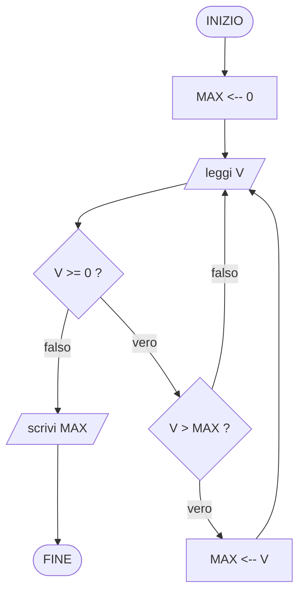

# Algoritmi 2
## 1

Leggi in sequenza valori interi positivi, in quantità non specificata, sino al primo valore negativo (che indica fine lettura), e stampa il massimo valore tra quelli positivi letti. Se non viene letto alcun valore positivo, stampa 0.

### Problema

- **I**: una serie di valori interi positivi e un valore negativo, acquisiti tramite lettura
- **O**: un numero naturale
- **R**: il numero naturale massimo della sequenza; se non si ha alcun numero positivo si stampa 0

### Esecutore
Insieme di passi elementari richiesto: lettura di un valore, confronto fra due numeri (esito vero/falso), memorizzazione in un contenitore, scrittura del risultato.

### Idea algoritmica
Si mantiene un contenitore MAX inizializzato a 0 (il valore da restituire se non si legge alcun positivo). Si legge ripetutamente un valore: finché è positivo, lo si confronta con MAX e, se maggiore, lo si memorizza in MAX; il ciclo termina non appena si legge un valore negativo (sentinella di fine lettura, non è un dato del problema, va solo scartato).

Nota sulla struttura del ciclo: la lettura del primo valore avviene *prima* di poter valutare la condizione (bisogna sapere se è negativo per decidere se entrare nel corpo), quindi si tratta di un ciclo pre-condizionale con una lettura "di innesco" fuori dal ciclo, ripetuta anche in coda al corpo (pattern "read-eval-loop" tipico della lettura con sentinella).

1. MAX <-- 0
2. leggi V
3. finché (V ≥ 0) ripeti:
	1. se (V > MAX) allora MAX <-- V
	2. leggi V
4. produci in uscita MAX
5. TERMINA

Verifica informale di correttezza: al termine del ciclo (quando si legge V < 0) MAX contiene il massimo fra tutti i valori positivi letti fino a quel momento, perché ad ogni iterazione MAX viene aggiornato solo se il nuovo valore è strettamente maggiore del massimo corrente (invariante: MAX = massimo dei positivi letti finora, o 0 se nessuno). Il ciclo termina perché la sequenza in ingresso è dichiarata finita (termina con un valore negativo).

#### Diagramma di flusso


#### Implementazione in ANSI C89
```c
#include <stdio.h>

int main(void)
{
    int v;
    int max = 0;

    printf("Inserisci una sequenza di interi positivi, terminata da un negativo: ");

    if (scanf("%d", &v) != 1) {
        return 1;
    }

    while (v >= 0) {
        if (v > max) {
            max = v;
        }
        if (scanf("%d", &v) != 1) {
            return 1;
        }
    }

    printf("Massimo = %d\n", max);

    return 0;
}
```
> Nota: si usa `int` (non `unsigned int`) perché il dato letto può essere negativo (la sentinella di fine lettura); il risultato prodotto, `max`, è invece sempre un numero naturale (≥ 0) come richiesto dalla specifica O.
