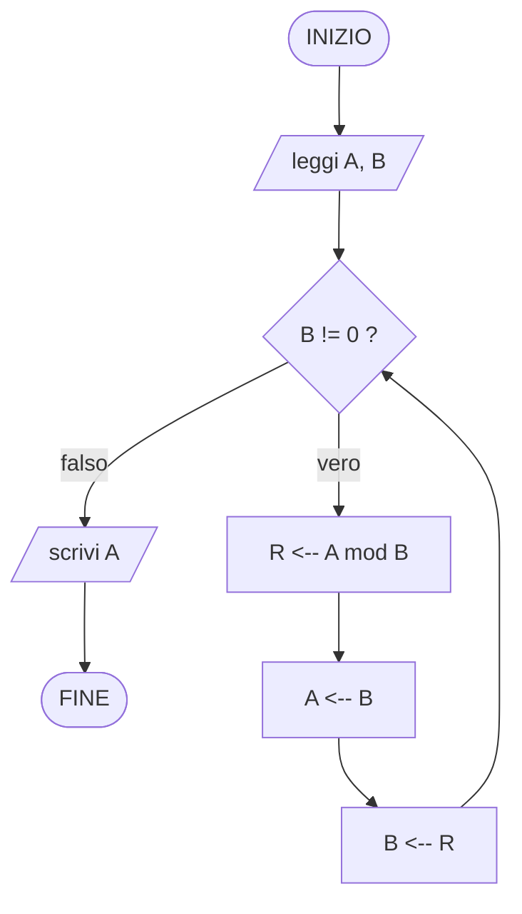
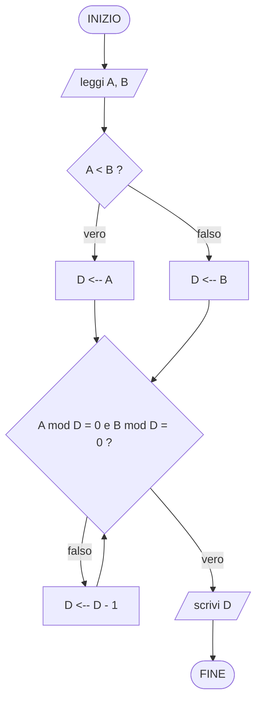

---
tags:
  - fondamenti-informatica
  - algoritmo
  - flowchart
  - ciclo-sentinella
---
# Algoritmi 2
## 1

Leggi in sequenza valori interi positivi, in quantità non specificata, sino al primo valore negativo (che indica fine lettura), e stampa il massimo valore tra quelli positivi letti. Se non viene letto alcun valore positivo, stampa 0.
Lo 0 o il valore negativo e chiamato **tappo**.

### Problema

- **I**: una serie di valori interi positivi e un valore negativo, acquisiti tramite lettura
- **O**: un numero naturale
- **R**: il numero naturale massimo della sequenza; se non si ha alcun numero positivo si stampa 0

### Esecutore
Insieme di passi elementari richiesto: lettura di un valore, confronto fra due numeri (esito vero/falso), memorizzazione in un contenitore, scrittura del risultato.

### Idea algoritmica
Si mantiene un contenitore MAX inizializzato a 0 (il valore da restituire se non si legge alcun positivo). Si legge ripetutamente un valore: finché è positivo, lo si confronta con MAX e, se maggiore, lo si memorizza in MAX; il ciclo termina non appena si legge un valore negativo (sentinella di fine lettura, non è un dato del problema, va solo scartato).

Nota sulla struttura del ciclo: la lettura del primo valore avviene *prima* di poter valutare la condizione (bisogna sapere se è negativo per decidere se entrare nel corpo), quindi si tratta di un ciclo pre-condizionale con una lettura "di innesco" fuori dal ciclo, ripetuta anche in coda al corpo (pattern "read-eval-loop" tipico della lettura con sentinella).

1. MAX <-- 0
2. leggi V
3. finché (V ≥ 0) ripeti:
	1. se (V > MAX) allora MAX <-- V
	2. leggi V
4. produci in uscita MAX
5. TERMINA

Verifica informale di correttezza: al termine del ciclo (quando si legge V < 0) MAX contiene il massimo fra tutti i valori positivi letti fino a quel momento, perché ad ogni iterazione MAX viene aggiornato solo se il nuovo valore è strettamente maggiore del massimo corrente (invariante: MAX = massimo dei positivi letti finora, o 0 se nessuno). Il ciclo termina perché la sequenza in ingresso è dichiarata finita (termina con un valore negativo).

#### Diagramma di flusso


#### Implementazione in ANSI C89
```c
#include <stdio.h>

int main(void)
{
    int v;
    int max = 0;

    printf("Inserisci una sequenza di interi positivi, terminata da un negativo: ");

    if (scanf("%d", &v) != 1) {
        return 1;
    }

    while (v >= 0) {
        if (v > max) {
            max = v;
        }
        if (scanf("%d", &v) != 1) {
            return 1;
        }
    }

    printf("Massimo = %d\n", max);

    return 0;
}
```

## 2.1
Reinvenzione dell'[[Algoritmo]] di Euclide per il calcolo del MCD di 2 numeri $\mathbb{N}$

### Problema
- **I**: 2 numeri naturali A, B (non entrambi nulli)
- **O**: un numero naturale
- **R**: il MCD tra i 2 numeri

### Esecutore
Insieme di passi elementari richiesto: lettura di un valore, confronto fra due numeri (esito vero/falso), calcolo del resto della divisione intera, assegnazione/memorizzazione in un contenitore, scrittura del risultato.

### Idea algoritmica
Si usa la versione "a resto" dell'[[Algoritmo]] di Euclide, basata sulla proprietà MCD(A, B) = MCD(B, A mod B), valida finché B ≠ 0, e sul caso base MCD(A, 0) = A.

Si leggono i due numeri in A e B. Finché B è diverso da 0, si calcola il resto R della divisione di A per B, poi si fa scorrere la coppia: A prende il valore di B e B prende il valore di R (si ricalcola sempre il resto rispetto ai valori aggiornati). Quando B diventa 0, A contiene il MCD cercato.

È un ciclo pre-condizionale (si valuta B ≠ 0 prima di entrare nel corpo): se in ingresso B è già 0, il ciclo non viene eseguito e si restituisce direttamente A, coerente col caso base.

1. leggi A, B
2. finché (B ≠ 0) ripeti:
	1. R <-- A mod B
	2. A <-- B
	3. B <-- R
3. produci in uscita A
4. TERMINA

Verifica informale di correttezza: l'invariante di ciclo è "MCD(A, B) = MCD(A₀, B₀)" (il MCD della coppia corrente coincide col MCD della coppia iniziale), mantenuto ad ogni iterazione dalla proprietà MCD(A, B) = MCD(B, A mod B). Il ciclo termina perché la sequenza dei resti è strettamente decrescente e limitata inferiormente da 0 (ogni resto è minore del divisore precedente), quindi in un numero finito di passi si raggiunge B = 0; a quel punto, per il caso base, A è il MCD cercato.

#### Diagramma di flusso


#### Implementazione in ANSI C89
```c
#include <stdio.h>

int main(void)
{
    int a, b, r;

    printf("Inserisci due numeri naturali: ");

    if (scanf("%d %d", &a, &b) != 2) {
        return 1;
    }

    while (b != 0) {
        r = a % b;
        a = b;
        b = r;
    }

    printf("MCD = %d\n", a);

    return 0;
}
```

## 2.2
Variante "ingenua" dell'[[Algoritmo]] per il calcolo del MCD: si parte dal più piccolo dei due numeri e lo si decrementa finché non si trova un valore che divide entrambi.

### Problema
- **I**: 2 numeri naturali A, B (non entrambi nulli)
- **O**: un numero naturale
- **R**: il MCD tra i 2 numeri

### Esecutore
Insieme di passi elementari richiesto: lettura di un valore, confronto fra due numeri (esito vero/falso), calcolo del resto della divisione intera, verifica di divisibilità (resto = 0), decremento, scrittura del risultato.

### Idea algoritmica
Ogni divisore comune di A e B è al più grande quanto il minore dei due, e D = 1 divide sempre entrambi: quindi basta partire da D = min(A, B) e scendere di 1 in 1 finché D non divide sia A sia B (resto nullo in entrambe le divisioni). Il primo D per cui questo accade, scendendo dall'alto, è per costruzione il più grande possibile: il MCD.

È meno efficiente dell'[[Algoritmo]] di Euclide (nel caso peggiore serve un numero di passi pari a min(A, B), invece che logaritmico), ma è più diretto da giustificare: è la traduzione letterale della definizione di MCD come "massimo divisore comune".

1. leggi A, B
2. se (A < B) allora D <-- A altrimenti D <-- B
3. finché non (A mod D = 0 e B mod D = 0) ripeti:
	1. D <-- D - 1
4. produci in uscita D
5. TERMINA

Verifica informale di correttezza: l'invariante è "nessun valore maggiore di D, tra quelli già scartati, divide sia A che B"; il ciclo esamina i candidati in ordine strettamente decrescente a partire da min(A, B), quindi il primo D accettato è il massimo divisore comune. Il ciclo termina certamente perché D = 1 divide sempre A e B, quindi il decremento raggiunge al più tardi quel valore.

#### Diagramma di flusso


#### Implementazione in ANSI C89
```c
#include <stdio.h>

int main(void)
{
    int a, b, d;

    printf("Inserisci due numeri naturali: ");

    if (scanf("%d %d", &a, &b) != 2) {
        return 1;
    }

    d = (a < b) ? a : b;

    while (a % d != 0 || b % d != 0) {
        d--;
    }

    printf("MCD = %d\n", d);

    return 0;
}
```

