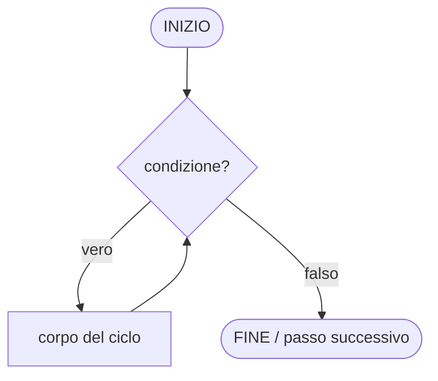
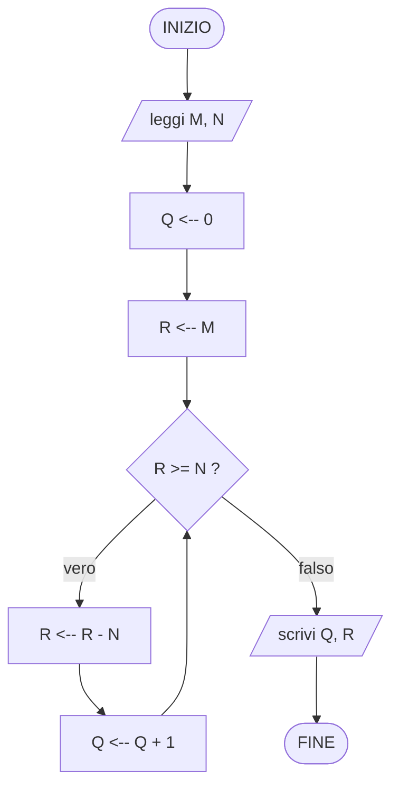

---
tags:
  - fondamenti-informatica
  - algoritmo
  - flowchart
  - boehm-jacopini
---
## Algoritmo
Un algoritmo si basa su due nozioni:
- **problema**
- **esecutore**
## Problema
Un problema è composto da una terna **(I, O, R)**:
- **I** — ingresso (input): deve soddisfare alcune condizioni di validità
- **O** — uscita (output): deve soddisfare alcune condizioni di validità
- **R** — relazione: deve essere soddisfatta per qualunque insieme di dati valido, tra dati in ingresso e risultati in uscita

### Esempio: minimo tra due numeri naturali
- **I** — due numeri naturali
- **O** — un numero naturale
- **R** — il risultato è uno dei due dati in ingresso: il risultato non è maggiore dell'altro dato (cioè è il minimo dei due)
#### Implementazione in ANSI C89
```c
#include <stdio.h>

/* R: restituisce il minore tra a e b (uno dei due dati, non maggiore dell'altro) */
unsigned int minimo(unsigned int a, unsigned int b)
{
    if (a < b) {
        return a;
    }
    return b;
}

int main(void)
{
    unsigned int a, b;

    printf("Inserisci due numeri naturali: ");
    if (scanf("%u %u", &a, &b) != 2) {
        return 1;
    }

    printf("Il minimo e' %u\n", minimo(a, b));

    return 0;
}
```
> Note ANSI C89: dichiarazioni delle variabili all'inizio del blocco, commenti solo `/* ... */`, `main` con prototipo esplicito `(void)`.

## Esecutore
Un sistema capace di eseguire in modo deterministico ciascun passo elementare appartenente a un insieme (esiguo) di passi elementari.
### Esempio
Insieme di passi elementari eseguibili:
- acquisizione dei dati ("lettura")
- produzione dei risultati ("scrittura")
- addizione di due numeri
- sottrazione fra due numeri
- confronto fra due numeri (calcolo dell'esito "vero" o "falso" di un confronto)

## Algoritmo (definizione formale)
Dati un problema P e un esecutore E, un algoritmo è una combinazione finita di passi elementari, ciascuno eseguibile dall'esecutore E, in grado di risolvere il problema P (cioè per qualunque insieme valido di dati in ingresso, produce in uscita risultati validi che soddisfano la relazione specificata tra ingresso e uscita).

### Esempio: l'opposto di un intero
1. acquisisci un intero
2. sottrai dal valore 0 il valore del numero acquisito
3. produci in uscita il risultato della sottrazione
4. TERMINA

### Esempio: massimo tra due numeri naturali
I: due numeri interi $d_1$ e $d_2$
O: un numero naturale
R: $r \in \{d_1, d_2\}$
$\quad r = d_1 \text{ se } d_1 > d_2$
$\quad r = d_2 \text{ se } d_1 < d_2$

1. acquisisci 2 numeri naturali
2. confronto i 2 numeri naturali
	1. se il primo è maggiore del secondo restituisco il primo
	2. se il secondo è maggiore del primo restituisco il secondo
3. TERMINA
## Combinazione
I passi elementari possono essere combinati in diversi modi: in **sequenza** (lineare) o tramite **selezione** (if/else) — e, come si vedrà, tramite **iterazione**.

## Diagrammi di flusso
Un diagramma di flusso (*flowchart*) è una rappresentazione grafica di un algoritmo: i passi elementari e i punti di decisione sono raffigurati con simboli standardizzati, collegati da frecce (edge) che ne indicano il flusso di controllo.

### Simboli fondamentali
| Simbolo                     | Forma           | Significato                                                |
| --------------------------- | --------------- | ---------------------------------------------------------- |
| **Terminatore**             | pillola/ellisse | punto di INIZIO o FINE dell'algoritmo                      |
| **Elaborazione (processo)** | rettangolo      | un'operazione elementare (es. assegnazione, calcolo)       |
| **Decisione**               | rombo           | test logico con due uscite (vero/falso)                    |
| **Input/Output**            | parallelogramma | acquisizione (lettura) o produzione (scrittura) di dati    |
| **Freccia (edge)**          | linea orientata | indica il flusso di controllo tra un passo e il successivo |

### Regole di costruzione
- Ogni diagramma ha un solo punto di INIZIO e almeno un punto di FINE.
- Ogni cammino che parte dall'INIZIO deve condurre, in un numero finito di passi, a un FINE (l'algoritmo deve terminare).
- Ogni simbolo di decisione ha esattamente due uscite (vero e falso).

### Le tre strutture di controllo fondamentali (teorema di Böhm-Jacopini)
Il teorema di Böhm-Jacopini (1966) dimostra che qualunque algoritmo calcolabile tramite diagramma di flusso può essere riscritto usando solo tre costrutti di controllo, opportunamente annidati e composti in sequenza — è la base teorica della **programmazione strutturata**:

1. **Sequenza** — due o più passi eseguiti uno dopo l'altro, nell'ordine in cui compaiono.
2. **Selezione** (if-then-else) — in base all'esito di una decisione, il flusso prosegue lungo uno tra due cammini alternativi, che poi si ricongiungono.
3. **Iterazione** (while/repeat) — un blocco di passi viene ripetuto finché una condizione resta soddisfatta (o finché non lo è più).

### Esempio: diagramma di flusso per il minimo tra due numeri naturali
Traduzione in diagramma di flusso dell'algoritmo visto sopra (§ Esempio: minimo tra due numeri naturali): una sequenza (INIZIO → lettura → scrittura → FINE) con una selezione al suo interno per stabilire quale dei due valori sia il minimo.

![[Diagramma di flusso - minimo.canvas]]

## Memorizzazione
Memorizzazione di un valore "in un contenitore": salvataggio e conservazione interna di un valore durante l'esecuzione di altri passi.

Sintatticamente indicati (da noi) con
```txt
A <-- ...
```
Qui A identifica il contenitore in cui verrà memorizzato il valore di ciò che sta dopo il simbolo `<--`.

Poi in ANSI C89:
```c
A = ... ;
```

```txt
A <-- A + B
```
Il contenitore A viene aggiornato con la somma del suo valore corrente e di B (letto prima di essere sovrascritto).

In ANSI C89:
```c
A = A + B;
```

## Scambio tra due contenitori
### Problema
I: due contenitori M e N, ciascuno con un valore memorizzato
O: gli stessi due contenitori M e N, ciascuno con un valore memorizzato
R: i valori dei due dati e dei due risultati sono gli stessi, ma tali valori sono memorizzati ciascuno nel contenitore in cui era inizialmente memorizzato l'altro (scambio)

### Esecutore
Insieme di passi elementari richiesto: lettura/scrittura di un contenitore e operazione **XOR bit a bit** (`^`) tra i valori di due contenitori (oltre alle operazioni elementari già viste).

### Codice
Scambio "classico" con contenitore ausiliario T:
1. T <-- M
2. M <-- N
3. N <-- T
4. TERMINA

Scambio **senza variabile ausiliaria**, sfruttando le proprietà dello XOR ($a \oplus a = 0$, $a \oplus 0 = a$, associativa e commutativa) — usa solo i due contenitori M e N:
1. M <-- M XOR N
2. N <-- M XOR N
3. M <-- M XOR N
4. TERMINA

#### Implementazione in ANSI C89
```c
#include <stdio.h>

/* R: scambia i valori di *m e *n usando solo le due variabili (XOR swap) */
void scambia(unsigned int *m, unsigned int *n)
{
    *m = *m ^ *n;
    *n = *m ^ *n;
    *m = *m ^ *n;
}

int main(void)
{
    unsigned int m, n;

    printf("Inserisci due numeri naturali: ");
    if (scanf("%u %u", &m, &n) != 2) {
        return 1;
    }

    scambia(&m, &n);

    printf("m = %u, n = %u\n", m, n);

    return 0;
}
```
> Attenzione: lo XOR swap fallisce se M e N sono lo **stesso** contenitore (`scambia(&x, &x)` azzera il valore) — in pratica si preferisce comunque la variabile ausiliaria per chiarezza e sicurezza; lo XOR swap è soprattutto un esercizio sulle proprietà dell'operatore.

## Altri modi per combinare passi elementari
Coerentemente col teorema di Böhm-Jacopini (§ sopra), i passi elementari di un algoritmo si combinano solo in tre modi:
- **sequenza**
- **selezione**
- **iterazione** (o ciclo)

### Iterazione (o ciclo)
Un ciclo è caratterizzato da:
- una **condizione** (espressione booleana, esito vero/falso), e
- una **sequenza** (più in generale, una combinazione) di passi elementari, detta **corpo del ciclo**.

Semantica operativa: ad ogni "giro" la condizione viene **valutata prima** di eseguire il corpo (ciclo *pre-condizionale*, tipico del `while`):
- se la condizione risulta **falsa**, il ciclo non viene eseguito (o non viene più eseguito) e il controllo passa al passo successivo al ciclo;
- se la condizione risulta **vera**, si esegue il corpo del ciclo, poi si ritorna a valutare nuovamente la condizione.

In altre parole: il corpo del ciclo viene eseguito ripetutamente, tante volte quante la condizione risulta vera — zero o più volte in totale.

Perché è una forma di combinazione a sé (non riducibile a sequenza+selezione): a differenza della selezione, dopo l'esecuzione del blocco il flusso **torna indietro** (arco all'indietro, *back-edge*) invece di proseguire in avanti; questo è ciò che permette di ripetere un numero di volte non noto a priori (dipendente dai dati in ingresso), condizione necessaria per poter esprimere computazioni come somme, ricerche o elaborazioni su sequenze di lunghezza arbitraria.

#### Diagramma di flusso del ciclo (pre-condizionale, tipo `while`)


#### Corrispondenza in ANSI C89
```c
while (condizione) {
    /* corpo del ciclo */
}
```

> Nota terminologica: questa è la forma **pre-condizionale** (`while`), in cui la condizione è valutata *prima* del corpo, quindi il corpo può essere eseguito **zero** volte. Esiste anche la forma **post-condizionale** (`do ... while` in C), in cui la condizione è valutata *dopo* il corpo: il corpo viene eseguito **almeno una volta**. Il teorema di Böhm-Jacopini richiede solo l'esistenza di una struttura iterativa; entrambe le varianti sono espressioni equivalenti dello stesso concetto di ciclo.

### Esempio: quoziente e resto della divisione intera
Esempio canonico di algoritmo che richiede l'**iterazione**: a differenza degli esempi precedenti (minimo, massimo, scambio), risolvibili con sole sequenza e selezione, qui il numero di passi da compiere dipende dal valore dei dati in ingresso e non è quindi fissabile a priori — da cui la necessità di un ciclo.

#### Problema
- **I** — due numeri naturali M e N, con $N \neq 0$ (la divisione per 0 non è definita: è una condizione di validità dell'ingresso)
- **O** — due numeri naturali Q e R
- **R** — Q è il quoziente della divisione intera di M per N, R è il resto di tale divisione; formalmente:
$$M = Q \cdot N + R, \quad 0 \le R < N$$

#### Idea algoritmica: divisione per sottrazioni successive
Sfruttando solo i passi elementari già visti (confronto, sottrazione, memorizzazione — senza bisogno dell'operatore di divisione), si calcola il quoziente contando quante volte N "entra" in M:
1. Q <-- 0
2. R <-- M
3. finché (R ≥ N) ripeti:
	1. R <-- R − N
	2. Q <-- Q + 1
4. produci in uscita Q e R
5. TERMINA

Verifica informale di correttezza: ad ogni iterazione l'invariante $M = Q \cdot N + R$ è mantenuto (si toglie N da R e si aggiunge 1 a Q, quindi il prodotto $Q \cdot N$ aumenta di N esattamente quanto R diminuisce); il ciclo termina perché R è un naturale che diminuisce di N > 0 ad ogni passo, quindi in un numero finito di passi si ha $R < N$.

#### Diagramma di flusso


#### Implementazione in ANSI C89
```c
#include <stdio.h>

/* R: q e' il quoziente e r il resto della divisione intera di m per n (n != 0) */
void divisione_intera(unsigned int m, unsigned int n, unsigned int *q, unsigned int *r)
{
    *q = 0;
    *r = m;

    while (*r >= n) {
        *r = *r - n;
        *q = *q + 1;
    }
}

int main(void)
{
    unsigned int m, n, q, r;

    printf("Inserisci due numeri naturali (dividendo divisore, divisore != 0): ");
    if (scanf("%u %u", &m, &n) != 2 || n == 0) {
        return 1;
    }

    divisione_intera(m, n, &q, &r);

    printf("Q = %u, R = %u\n", q, r);

    return 0;
}
```
> Nota: nella pratica C il compilatore traduce `m / n` e `m % n` in un'unica istruzione macchina di divisione, ben più efficiente di questo ciclo; 


## Aritmetica intera in base B
Generalizzazione delle operazioni aritmetiche (addizione, sottrazione, moltiplicazione, divisione) a un intero rappresentato in una base $B \geq 2$ qualunque (non solo B = 10), tramite un esecutore che dispone unicamente di passi elementari su singole **cifre** (confronto, addizione/sottrazione di cifre, memorizzazione) — esattamente come si esegue "a mano" un'operazione in colonna.

### Rappresentazione posizionale
Un numero naturale N in base B è rappresentato come sequenza di cifre $d_{k-1} d_{k-2} \dots d_1 d_0$, con $0 \le d_i < B$, tale che:
$$N = \sum_{i=0}^{k-1} d_i \cdot B^i$$
Per l'esecutore, N è quindi un **vettore di cifre** (array), indicizzato dalla cifra meno significativa ($d_0$) alla più significativa; l'operazione aritmetica elementare disponibile è quella su una singola cifra, con eventuale **riporto** (addizione/moltiplicazione) o **prestito** (sottrazione) da propagare alla cifra successiva — esattamente come l'algoritmo di divisione per sottrazioni successive (§ sopra) propaga il confronto ad ogni iterazione.

### Addizione (A + B, colonna con riporto)
#### Problema
- **I** — due vettori di cifre A e B in base B (stessa base), di lunghezza $n$ e $m$
- **O** — un vettore di cifre S (somma), di lunghezza al più $\max(n,m)+1$
- **R** — S rappresenta, secondo la formula posizionale sopra, la somma dei valori rappresentati da A e B

#### Idea algoritmica
Si procede cifra per cifra da destra (meno significativa) verso sinistra, mantenendo un **riporto** (carry) che vale inizialmente 0:
1. i <-- 0, riporto <-- 0
2. finché (i < lunghezza massima oppure riporto ≠ 0) ripeti:
	1. t <-- A[i] + B[i] + riporto  *(cifre mancanti trattate come 0)*
	2. S[i] <-- t mod Base
	3. riporto <-- t div Base   *(vale 0 oppure 1)*
	4. i <-- i + 1
3. produci in uscita S
4. TERMINA

Correttezza: ad ogni passo $t < 2 \cdot Base$ (due cifre + riporto al più 1), quindi $t \; div \; Base \in \{0,1\}$ — un solo bit/cifra di riporto basta, come nell'addizione in colonna appresa a scuola.

#### Implementazione in ANSI C89 (base B generica, cifre in array `unsigned int`)
```c
#include <stdio.h>

/* R: somma le cifre di a (na cifre) e b (nb cifre) in base "base",
   scrive il risultato in s (deve avere spazio per max(na,nb)+1 cifre),
   restituisce il numero di cifre effettive del risultato.
   Cifre indicizzate dalla meno significativa (indice 0). */
int somma_base_b(const unsigned int *a, int na,
                  const unsigned int *b, int nb,
                  unsigned int base, unsigned int *s)
{
    int i, n;
    unsigned int riporto, t, da, db;

    n = (na > nb) ? na : nb;
    riporto = 0;

    for (i = 0; i < n || riporto != 0; i++) {
        da = (i < na) ? a[i] : 0;
        db = (i < nb) ? b[i] : 0;
        t = da + db + riporto;
        s[i] = t % base;
        riporto = t / base;
    }

    return i; /* numero di cifre scritte in s */
}
```

### Sottrazione (A − B, colonna con prestito, $A \geq B$)
#### Problema
- **I** — due vettori di cifre A e B in base B, con $A \geq B$ (altrimenti il risultato non è un naturale)
- **O** — un vettore di cifre D (differenza)
- **R** — D rappresenta il valore $A - B$

#### Idea algoritmica
Simmetrica all'addizione, ma con un **prestito** (borrow, $\in \{0,1\}$) invece del riporto: se la cifra di A (al netto del prestito) è minore di quella di B, si "prende in prestito" una unità dalla base successiva:
1. i <-- 0, prestito <-- 0
2. finché (i < lunghezza di A) ripeti:
	1. t <-- A[i] − prestito − B[i]  *(cifre mancanti di B trattate come 0)*
	2. se (t < 0) allora: D[i] <-- t + Base, prestito <-- 1
	3. altrimenti: D[i] <-- t, prestito <-- 0
	4. i <-- i + 1
3. produci in uscita D (eliminando eventuali zeri non significativi in testa)
4. TERMINA

Poiché $A \geq B$ per ipotesi, il prestito finale è sempre 0.

### Moltiplicazione (A × B)
#### Problema
- **I** — due vettori di cifre A ($n$ cifre) e B ($m$ cifre) in base B
- **O** — un vettore di cifre P (prodotto), di lunghezza al più $n+m$
- **R** — P rappresenta il valore $A \cdot B$

#### Idea algoritmica: moltiplicazione in colonna (come a mano)
Si moltiplica A per ciascuna cifra di B, si accumulano i **prodotti parziali** opportunamente scalati (shiftati) di una posizione per ogni cifra di B già processata, sommandoli con l'addizione già definita sopra:
1. P <-- vettore di soli zeri, lunghezza $n+m$
2. per j <-- 0 fino a $m-1$ ripeti:
	1. riporto <-- 0
	2. per i <-- 0 fino a $n-1$ ripeti:
		1. t <-- P[i+j] + A[i] · B[j] + riporto
		2. P[i+j] <-- t mod Base
		3. riporto <-- t div Base
	3. P[n+j] <-- P[n+j] + riporto   *(propagazione dell'ultimo riporto)*
3. produci in uscita P
4. TERMINA

Correttezza (idea): è la formalizzazione cifra-per-cifra di $A \cdot B = A \cdot \sum_j B[j]\cdot Base^j = \sum_j (A \cdot B[j]) \cdot Base^j$ — ogni prodotto parziale $A \cdot B[j]$ viene sommato a P già shiftato di $j$ posizioni (cioè scritto a partire dall'indice $i+j$).

### Divisione (Q, R tali che $A = Q \cdot Base_N + R$, $N \neq 0$)
#### Idea algoritmica
L'algoritmo per sottrazioni successive visto sopra (§ Esempio: quoziente e resto della divisione intera) resta valido invariato: usa solo confronto, sottrazione e memorizzazione, indipendenti dalla base scelta per rappresentare i numeri — la base entra in gioco solo nella *rappresentazione* di A, N, Q, R come vettori di cifre (usando la sottrazione in colonna definita sopra al posto della sottrazione "in blocco"), non nella logica dell'algoritmo. In pratica, per basi grandi, si preferisce una variante **cifra per cifra** (divisione lunga): si processano le cifre di A da sinistra a destra, mantenendo un resto parziale R (inizialmente 0) a cui si accosta ad ogni passo la cifra successiva di A, e si sottrae N da R il maggior numero di volte possibile (al più $Base-1$, tramite confronti ripetuti) prima di passare alla cifra successiva — stessa idea, applicata localmente ad ogni cifra invece che al numero intero.

Continue con [[Algoritmi 2]]