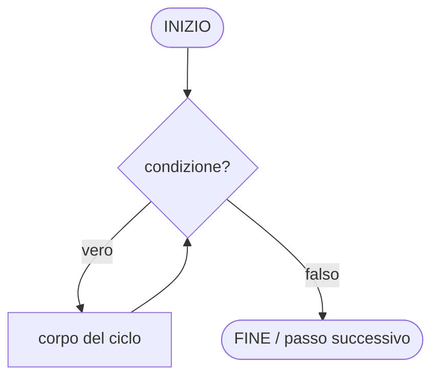
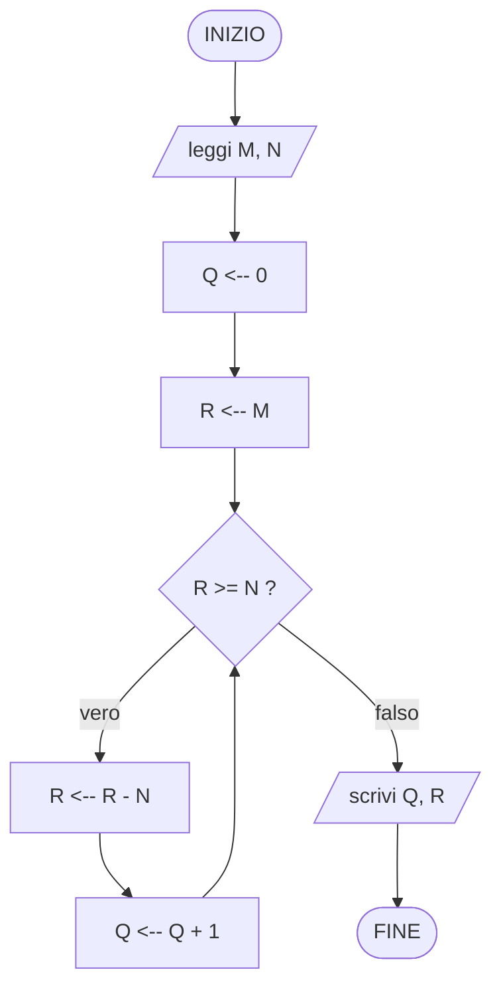

---
tags:
  - fondamenti-informatica
  - algoritmo
  - flowchart
  - boehm-jacopini
---
## Algoritmo
Un algoritmo si basa su due nozioni:
- **problema**
- **esecutore**
## Problema
Un problema è composto da una terna **(I, O, R)**:
- **I** — ingresso (input): deve soddisfare alcune condizioni di validità
- **O** — uscita (output): deve soddisfare alcune condizioni di validità
- **R** — relazione: deve essere soddisfatta per qualunque insieme di dati valido, tra dati in ingresso e risultati in uscita

### Esempio: minimo tra due numeri naturali
- **I** — due numeri naturali
- **O** — un numero naturale
- **R** — il risultato è uno dei due dati in ingresso: il risultato non è maggiore dell'altro dato (cioè è il minimo dei due)
#### Implementazione in ANSI C89
```c
#include <stdio.h>

/* R: restituisce il minore tra a e b (uno dei due dati, non maggiore dell'altro) */
unsigned int minimo(unsigned int a, unsigned int b)
{
    if (a < b) {
        return a;
    }
    return b;
}

int main(void)
{
    unsigned int a, b;

    printf("Inserisci due numeri naturali: ");
    if (scanf("%u %u", &a, &b) != 2) {
        return 1;
    }

    printf("Il minimo e' %u\n", minimo(a, b));

    return 0;
}
```
> Note ANSI C89: dichiarazioni delle variabili all'inizio del blocco, commenti solo `/* ... */`, `main` con prototipo esplicito `(void)`.

## Esecutore
Un sistema capace di eseguire in modo deterministico ciascun passo elementare appartenente a un insieme (esiguo) di passi elementari.
### Esempio
Insieme di passi elementari eseguibili:
- acquisizione dei dati ("lettura")
- produzione dei risultati ("scrittura")
- addizione di due numeri
- sottrazione fra due numeri
- confronto fra due numeri (calcolo dell'esito "vero" o "falso" di un confronto)

## Algoritmo (definizione formale)
Dati un problema P e un esecutore E, un algoritmo è una combinazione finita di passi elementari, ciascuno eseguibile dall'esecutore E, in grado di risolvere il problema P (cioè per qualunque insieme valido di dati in ingresso, produce in uscita risultati validi che soddisfano la relazione specificata tra ingresso e uscita).

### Esempio: l'opposto di un intero
1. acquisisci un intero
2. sottrai dal valore 0 il valore del numero acquisito
3. produci in uscita il risultato della sottrazione
4. TERMINA

### Esempio: massimo tra due numeri naturali
I: due numeri interi $d_1$ e $d_2$
O: un numero naturale
R: $r \in \{d_1, d_2\}$
$\quad r = d_1 \text{ se } d_1 > d_2$
$\quad r = d_2 \text{ se } d_1 < d_2$

1. acquisisci 2 numeri naturali
2. confronto i 2 numeri naturali
	1. se il primo è maggiore del secondo restituisco il primo
	2. se il secondo è maggiore del primo restituisco il secondo
3. TERMINA
## Combinazione
I passi elementari possono essere combinati in diversi modi: in **sequenza** (lineare) o tramite **selezione** (if/else) — e, come si vedrà, tramite **iterazione**.

## Diagrammi di flusso
Un diagramma di flusso (*flowchart*) è una rappresentazione grafica di un algoritmo: i passi elementari e i punti di decisione sono raffigurati con simboli standardizzati, collegati da frecce (edge) che ne indicano il flusso di controllo.

### Simboli fondamentali
| Simbolo                     | Forma           | Significato                                                |
| --------------------------- | --------------- | ---------------------------------------------------------- |
| **Terminatore**             | pillola/ellisse | punto di INIZIO o FINE dell'algoritmo                      |
| **Elaborazione (processo)** | rettangolo      | un'operazione elementare (es. assegnazione, calcolo)       |
| **Decisione**               | rombo           | test logico con due uscite (vero/falso)                    |
| **Input/Output**            | parallelogramma | acquisizione (lettura) o produzione (scrittura) di dati    |
| **Freccia (edge)**          | linea orientata | indica il flusso di controllo tra un passo e il successivo |

### Regole di costruzione
- Ogni diagramma ha un solo punto di INIZIO e almeno un punto di FINE.
- Ogni cammino che parte dall'INIZIO deve condurre, in un numero finito di passi, a un FINE (l'algoritmo deve terminare).
- Ogni simbolo di decisione ha esattamente due uscite (vero e falso).

### Le tre strutture di controllo fondamentali (teorema di Böhm-Jacopini)
Il teorema di Böhm-Jacopini (1966) dimostra che qualunque algoritmo calcolabile tramite diagramma di flusso può essere riscritto usando solo tre costrutti di controllo, opportunamente annidati e composti in sequenza — è la base teorica della **programmazione strutturata**:

1. **Sequenza** — due o più passi eseguiti uno dopo l'altro, nell'ordine in cui compaiono.
2. **Selezione** (if-then-else) — in base all'esito di una decisione, il flusso prosegue lungo uno tra due cammini alternativi, che poi si ricongiungono.
3. **Iterazione** (while/repeat) — un blocco di passi viene ripetuto finché una condizione resta soddisfatta (o finché non lo è più).

### Esempio: diagramma di flusso per il minimo tra due numeri naturali
Traduzione in diagramma di flusso dell'algoritmo visto sopra (§ Esempio: minimo tra due numeri naturali): una sequenza (INIZIO → lettura → scrittura → FINE) con una selezione al suo interno per stabilire quale dei due valori sia il minimo.

![[Diagramma di flusso - minimo.canvas]]

## Memorizzazione
Memorizzazione di un valore "in un contenitore": salvataggio e conservazione interna di un valore durante l'esecuzione di altri passi.

Sintatticamente indicati (da noi) con
```txt
A <-- ...
```
Qui A identifica il contenitore in cui verrà memorizzato il valore di ciò che sta dopo il simbolo `<--`.

Poi in ANSI C89:
```c
A = ... ;
```

```txt
A <-- A + B
```
Il contenitore A viene aggiornato con la somma del suo valore corrente e di B (letto prima di essere sovrascritto).

In ANSI C89:
```c
A = A + B;
```

## Scambio tra due contenitori
### Problema
I: due contenitori M e N, ciascuno con un valore memorizzato
O: gli stessi due contenitori M e N, ciascuno con un valore memorizzato
R: i valori dei due dati e dei due risultati sono gli stessi, ma tali valori sono memorizzati ciascuno nel contenitore in cui era inizialmente memorizzato l'altro (scambio)

### Esecutore
Insieme di passi elementari richiesto: lettura/scrittura di un contenitore e operazione **XOR bit a bit** (`^`) tra i valori di due contenitori (oltre alle operazioni elementari già viste).

### Codice
Scambio "classico" con contenitore ausiliario T:
1. T <-- M
2. M <-- N
3. N <-- T
4. TERMINA

Scambio **senza variabile ausiliaria**, sfruttando le proprietà dello XOR ($a \oplus a = 0$, $a \oplus 0 = a$, associativa e commutativa) — usa solo i due contenitori M e N:
1. M <-- M XOR N
2. N <-- M XOR N
3. M <-- M XOR N
4. TERMINA

#### Implementazione in ANSI C89
```c
#include <stdio.h>

/* R: scambia i valori di *m e *n usando solo le due variabili (XOR swap) */
void scambia(unsigned int *m, unsigned int *n)
{
    *m = *m ^ *n;
    *n = *m ^ *n;
    *m = *m ^ *n;
}

int main(void)
{
    unsigned int m, n;

    printf("Inserisci due numeri naturali: ");
    if (scanf("%u %u", &m, &n) != 2) {
        return 1;
    }

    scambia(&m, &n);

    printf("m = %u, n = %u\n", m, n);

    return 0;
}
```
> Attenzione: lo XOR swap fallisce se M e N sono lo **stesso** contenitore (`scambia(&x, &x)` azzera il valore) — in pratica si preferisce comunque la variabile ausiliaria per chiarezza e sicurezza; lo XOR swap è soprattutto un esercizio sulle proprietà dell'operatore.

## Altri modi per combinare passi elementari
Coerentemente col teorema di Böhm-Jacopini (§ sopra), i passi elementari di un algoritmo si combinano solo in tre modi:
- **sequenza**
- **selezione**
- **iterazione** (o ciclo)

### Iterazione (o ciclo)
Un ciclo è caratterizzato da:
- una **condizione** (espressione booleana, esito vero/falso), e
- una **sequenza** (più in generale, una combinazione) di passi elementari, detta **corpo del ciclo**.

Semantica operativa: ad ogni "giro" la condizione viene **valutata prima** di eseguire il corpo (ciclo *pre-condizionale*, tipico del `while`):
- se la condizione risulta **falsa**, il ciclo non viene eseguito (o non viene più eseguito) e il controllo passa al passo successivo al ciclo;
- se la condizione risulta **vera**, si esegue il corpo del ciclo, poi si ritorna a valutare nuovamente la condizione.

In altre parole: il corpo del ciclo viene eseguito ripetutamente, tante volte quante la condizione risulta vera — zero o più volte in totale.

Perché è una forma di combinazione a sé (non riducibile a sequenza+selezione): a differenza della selezione, dopo l'esecuzione del blocco il flusso **torna indietro** (arco all'indietro, *back-edge*) invece di proseguire in avanti; questo è ciò che permette di ripetere un numero di volte non noto a priori (dipendente dai dati in ingresso), condizione necessaria per poter esprimere computazioni come somme, ricerche o elaborazioni su sequenze di lunghezza arbitraria.

#### Diagramma di flusso del ciclo (pre-condizionale, tipo `while`)


#### Corrispondenza in ANSI C89
```c
while (condizione) {
    /* corpo del ciclo */
}
```

> Nota terminologica: questa è la forma **pre-condizionale** (`while`), in cui la condizione è valutata *prima* del corpo, quindi il corpo può essere eseguito **zero** volte. Esiste anche la forma **post-condizionale** (`do ... while` in C), in cui la condizione è valutata *dopo* il corpo: il corpo viene eseguito **almeno una volta**. Il teorema di Böhm-Jacopini richiede solo l'esistenza di una struttura iterativa; entrambe le varianti sono espressioni equivalenti dello stesso concetto di ciclo.

### Esempio: quoziente e resto della divisione intera
Esempio canonico di algoritmo che richiede l'**iterazione**: a differenza degli esempi precedenti (minimo, massimo, scambio), risolvibili con sole sequenza e selezione, qui il numero di passi da compiere dipende dal valore dei dati in ingresso e non è quindi fissabile a priori — da cui la necessità di un ciclo.

#### Problema
- **I** — due numeri naturali M e N, con $N \neq 0$ (la divisione per 0 non è definita: è una condizione di validità dell'ingresso)
- **O** — due numeri naturali Q e R
- **R** — Q è il quoziente della divisione intera di M per N, R è il resto di tale divisione; formalmente:
$$M = Q \cdot N + R, \quad 0 \le R < N$$

#### Idea algoritmica: divisione per sottrazioni successive
Sfruttando solo i passi elementari già visti (confronto, sottrazione, memorizzazione — senza bisogno dell'operatore di divisione), si calcola il quoziente contando quante volte N "entra" in M:
1. Q <-- 0
2. R <-- M
3. finché (R ≥ N) ripeti:
	1. R <-- R − N
	2. Q <-- Q + 1
4. produci in uscita Q e R
5. TERMINA

Verifica informale di correttezza: ad ogni iterazione l'invariante $M = Q \cdot N + R$ è mantenuto (si toglie N da R e si aggiunge 1 a Q, quindi il prodotto $Q \cdot N$ aumenta di N esattamente quanto R diminuisce); il ciclo termina perché R è un naturale che diminuisce di N > 0 ad ogni passo, quindi in un numero finito di passi si ha $R < N$.

#### Diagramma di flusso


#### Implementazione in ANSI C89
```c
#include <stdio.h>

/* R: q e' il quoziente e r il resto della divisione intera di m per n (n != 0) */
void divisione_intera(unsigned int m, unsigned int n, unsigned int *q, unsigned int *r)
{
    *q = 0;
    *r = m;

    while (*r >= n) {
        *r = *r - n;
        *q = *q + 1;
    }
}

int main(void)
{
    unsigned int m, n, q, r;

    printf("Inserisci due numeri naturali (dividendo divisore, divisore != 0): ");
    if (scanf("%u %u", &m, &n) != 2 || n == 0) {
        return 1;
    }

    divisione_intera(m, n, &q, &r);

    printf("Q = %u, R = %u\n", q, r);

    return 0;
}
```
> Nota: nella pratica C il compilatore traduce `m / n` e `m % n` in un'unica istruzione macchina di divisione, ben più efficiente di questo ciclo; 

### Esempio: conversione di un naturale in base B

#### Problema
- **I** — un numero naturale M e una base B, con $B \ge 2$
- **O** — la sequenza di cifre $(d_{k-1} \dots d_1 d_0)$, con $0 \le d_i < B$
- **R** — il vettore prodotto è la rappresentazione posizionale di M in base B, cioè:
$$M = \sum_{i=0}^{k-1} d_i \cdot B^i$$

#### Idea algoritmica: divisioni successive per B
Le cifre si estraggono dalla meno significativa alla più significativa dividendo ripetutamente per B: il **resto** di ogni divisione è la cifra corrente, il **quoziente** diventa il nuovo dividendo. È lo stesso schema della divisione intera vista sopra, applicato più volte.
1. i <-- 0
2. finché (M > 0) ripeti:
	1. d[i] <-- M mod B
	2. M <-- M div B
	3. i <-- i + 1
3. se i = 0 (M era già 0): d[0] <-- 0, i <-- 1
4. produci in uscita d[i−1], ..., d[1], d[0] (ordine inverso rispetto a quello di calcolo)
5. TERMINA

Verifica informale: ad ogni passo M viene sostituito da $M \operatorname{div} B$, quantità che diminuisce strettamente finché $M>0$ (poiché $B \ge 2$), quindi il ciclo termina in un numero finito di passi con $M=0$; la cifra estratta ad ogni passo è per costruzione $0 \le d_i < B$.

#### Implementazione in ANSI C89
```c
#include <stdio.h>

/* R: riempie digits[] con le cifre di m in base b, dalla piu' significativa
   a scendere; restituisce il numero di cifre. Richiede 2 <= b <= 10
   (una cifra decimale per carattere) e max_cifre sufficienti a contenerle */
int converti_in_base(unsigned int m, unsigned int b, unsigned int digits[], int max_cifre)
{
    unsigned int tmp[32]; /* in base 2 un unsigned int a 32 bit usa al piu' 32 cifre */
    int i = 0;
    int k;

    do {
        unsigned int q, r;
        divisione_intera(m, b, &q, &r); /* riusa la funzione definita sopra */
        tmp[i] = r;
        m = q;
        i++;
    } while (m > 0 && i < max_cifre);

    for (k = 0; k < i; k++) {
        digits[k] = tmp[i - 1 - k]; /* inverte: da piu' a meno significativa */
    }

    return i;
}

int main(void)
{
    unsigned int m, b, digits[32];
    int n, k;

    printf("Inserisci un numero naturale e la base (2-10): ");
    if (scanf("%u %u", &m, &b) != 2 || b < 2 || b > 10) {
        return 1;
    }

    n = converti_in_base(m, b, digits, 32);
    for (k = 0; k < n; k++) {
        printf("%u", digits[k]);
    }
    printf("\n");

    return 0;
}
```

### Esempio: aritmetica in base B su vettori di cifre

#### Problema
- **I** — due numeri rappresentati come vettori di cifre in una stessa base B (indice 0 = cifra meno significativa) e un'operazione tra $\{+,-,\times,\div\}$
- **O** — il vettore di cifre in base B che rappresenta il risultato
- **R** — il valore rappresentato dal risultato è, rispettivamente, la somma, la differenza (per cui si richiede $A \ge B_{op}$), il prodotto o il quoziente dei valori rappresentati da A e $B_{op}$ (per la divisione si richiede $B_{op} \neq 0$)

#### Idea algoritmica: gli algoritmi "in colonna" della scuola primaria
Le quattro operazioni si eseguono cifra per cifra, propagando un **riporto** (addizione, moltiplicazione) o un **prestito** (sottrazione); la divisione si riconduce a sottrazioni successive cifra per cifra, come nella divisione intera. Di seguito il caso di moltiplicazione/divisione per una singola cifra k (0 ≤ k < B): è il passo elementare su cui si basano moltiplicazione e divisione "lunghe" tra due vettori di più cifre.

- **Addizione**: per i crescenti, `s <-- a[i] + b[i] + riporto`; cifra `s mod B`, nuovo riporto `s div B`.
- **Sottrazione**: per i crescenti, `d <-- a[i] - b[i] - prestito`; se `d < 0` allora `d <-- d + B` e prestito = 1, altrimenti prestito = 0.
- **Moltiplicazione per una cifra k**: per i crescenti, `p <-- a[i]*k + riporto`; cifra `p mod B`, nuovo riporto `p div B`.
- **Divisione per una cifra k**: per i **decrescenti** (dalla cifra più significativa), `v <-- resto*B + a[i]`; cifra `v div k`, nuovo resto `v mod k`.

In tutti i casi il ciclo termina perché scorre un numero finito e fissato di cifre (al più una in più per il riporto finale).

#### Implementazione in ANSI C89
```c
#include <stdio.h>

/* R: c = a + b (indice 0 = cifra meno significativa); restituisce il
   numero di cifre del risultato */
int add_digits(const unsigned int a[], int na, const unsigned int b[], int nb,
                unsigned int base, unsigned int c[])
{
    int i, n = na > nb ? na : nb;
    unsigned int carry = 0;

    for (i = 0; i < n; i++) {
        unsigned int s = (i < na ? a[i] : 0) + (i < nb ? b[i] : 0) + carry;
        c[i] = s % base;
        carry = s / base;
    }
    if (carry > 0) {
        c[n] = carry;
        n++;
    }
    return n;
}

/* R: c = a - b, richiede a >= b (quindi na >= nb); restituisce il numero
   di cifre del risultato, senza zeri non significativi in testa */
int sub_digits(const unsigned int a[], int na, const unsigned int b[], int nb,
               unsigned int base, unsigned int c[])
{
    int i, borrow = 0;

    for (i = 0; i < na; i++) {
        int d = (int) a[i] - (i < nb ? (int) b[i] : 0) - borrow;
        if (d < 0) {
            d += (int) base;
            borrow = 1;
        } else {
            borrow = 0;
        }
        c[i] = (unsigned int) d;
    }
    while (na > 1 && c[na - 1] == 0) {
        na--;
    }
    return na;
}

/* R: c = a * k, con k singola cifra (0 <= k < base) */
int mul_by_digit(const unsigned int a[], int na, unsigned int k,
                  unsigned int base, unsigned int c[])
{
    int i, n = na;
    unsigned int carry = 0;

    for (i = 0; i < na; i++) {
        unsigned int p = a[i] * k + carry;
        c[i] = p % base;
        carry = p / base;
    }
    while (carry > 0) {
        c[n] = carry % base;
        carry /= base;
        n++;
    }
    return n;
}

/* R: c = a / k (quoziente), *resto = a % k, con k singola cifra (0 < k < base) */
int div_by_digit(const unsigned int a[], int na, unsigned int k,
                  unsigned int base, unsigned int c[], unsigned int *resto)
{
    int i;
    unsigned int r = 0;

    for (i = na - 1; i >= 0; i--) {
        unsigned int v = r * base + a[i];
        c[i] = v / k;
        r = v % k;
    }
    while (na > 1 && c[na - 1] == 0) {
        na--;
    }
    *resto = r;
    return na;
}
```
> Nota: moltiplicazione e divisione per un vettore di più cifre (non solo una singola cifra k) si ottengono componendo questi passi elementari — rispettivamente come somma di prodotti parziali traslati di una posizione, e come sequenza di stime di cifra + sottrazione, esattamente come nell'algoritmo "in colonna" manuale.

Continue con [[Algoritmi 2]]

Collegato: [[Programma]] (dall'algoritmo al programma eseguibile), [[Rappresentazione dei numeri binario, complementi, ASCII, virgola fissa-mobile]]
